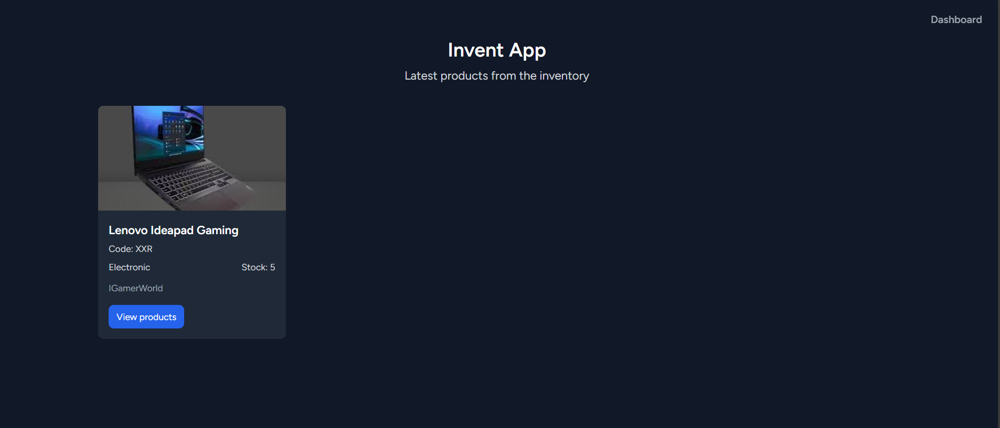
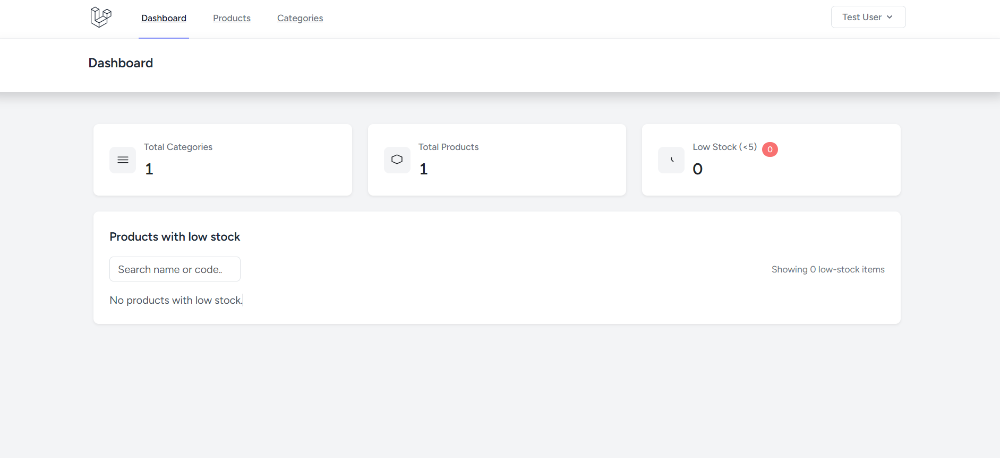

# Invent App

Simple inventory management application built with Laravel 10.

This repository includes a Docker setup so you can run the app locally with a single command.

## Quick start (Docker)

Requirements: Docker & Docker Compose installed.

1. Build and start the containers:

```bash
docker-compose up --build -d
```

2. Install composer dependencies (inside the app container):

```bash
docker-compose exec app composer install
```

3. Create `.env` from example and generate app key:

```bash
docker-compose exec app cp .env.example .env
docker-compose exec app php artisan key:generate
```

4. Run migrations and seed (optional):

```bash
docker-compose exec app php artisan migrate --seed
```

5. Access the app in your browser:

-   App: http://localhost:8080
-   Mail UI (Mailpit): http://localhost:8025

## Development notes

-   Database is MySQL running in `db` service. Default credentials are defined in `docker-compose.yml` (root/secret, database `invent_app`).
-   Storage should be linked (if needed): `php artisan storage:link` inside app container.
-   To run tests inside container: `docker-compose exec app ./vendor/bin/phpunit`

### Dummy credentials (for testing)

-   Admin / tester user (created by seeder):
    -   Email: `test@example.com`
    -   Password: `password`

Use the above credentials to sign in during local development. If the user is not present, run:

```bash
docker-compose exec app php artisan migrate --seed
```

### Branches

-   `main`: production-ready code
-   `develop`: active development branch (created in this repository)

## Features

-   Product & Category CRUD with image upload (Laravel Storage)
-   Dashboard with low-stock listing
-   Responsive product listing and product detail modal

## Files added for Docker

-   `Dockerfile` - PHP-FPM image
-   `docker-compose.yml` - app, web (nginx), db (mysql), mailpit
-   `docker/nginx/default.conf` - nginx config
-   `.dockerignore`

## Notes

-   The project uses Vite/Tailwind and Bootstrap in some views. For production, consider building assets with `npm run build`.
-   If you want I can add a GitHub Actions workflow to run tests on push/PR.

## Vite / Frontend dev server

-   The repository includes a `node` service in `docker-compose.yml` which runs the Vite dev server.
-   To start Vite inside Docker (hot reload), run:

```bash
docker-compose up -d node
```

-   Vite will be available on http://localhost:5173 and Blade templates will load assets from the dev server automatically during development.

## Screenshot



